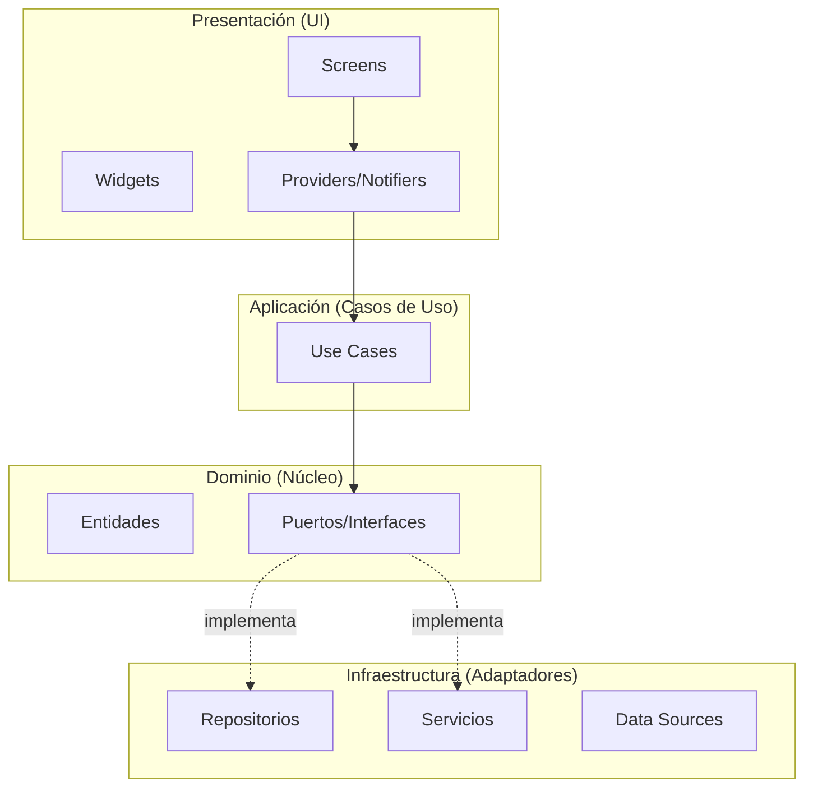

# Arquitectura del Proyecto - antigravity_player

## Resumen

Este proyecto implementa **Arquitectura Hexagonal** (Ports & Adapters) con **Riverpod 3.0.3** para la gestión del estado.

## Diagrama de Capas



## Estructura de Directorios

```
lib/
├── application/           # Casos de uso (lógica de negocio)
│   ├── use_case.dart      # Clase base abstracta
│   └── use_cases/
│       ├── load_video_use_case.dart
│       ├── seek_video_use_case.dart
│       └── toggle_playback_use_case.dart
│
├── domain/                # Núcleo del negocio (sin dependencias externas)
│   ├── entities/          # Objetos de valor
│   │   ├── video_entity.dart
│   │   ├── playlist_entity.dart
│   │   └── player_error.dart
│   └── repositories/      # Interfaces (Puertos)
│       ├── video_repository.dart
│       └── streaming_repository.dart
│
├── infrastructure/        # Implementaciones concretas (Adaptadores)
│   ├── repositories/      # Implementaciones de puertos
│   │   ├── media_kit_video_repository.dart
│   │   ├── fvp_video_repository.dart
│   │   └── local_streaming_repository.dart
│   └── services/          # Servicios externos
│       ├── telegram_service.dart
│       ├── local_streaming_proxy.dart
│       └── playback_storage_service.dart
│
├── presentation/          # UI y estado
│   ├── providers/         # Riverpod Notifiers
│   ├── screens/           # Pantallas
│   └── widgets/           # Componentes reutilizables
│
└── config/                # Configuración global
    ├── router/
    ├── theme/
    └── constants/
```

## Flujo de Dependencias

```
UI → Providers → Use Cases → Domain Interfaces ← Infrastructure
```

**Regla fundamental:** Las capas internas nunca dependen de las externas. El dominio es puro y no tiene dependencias de flutter ni infraestructura.

## Riverpod 3.0.3 - Patrones Utilizados

### 1. Notifiers con `@riverpod`
```dart
@riverpod
class PlayerNotifier extends _$PlayerNotifier {
  @override
  PlayerState build() {
    // Inicialización
    ref.onDispose(() {...});
    return PlayerState();
  }
}
```

### 2. Providers de Dependencias
```dart
final videoRepositoryProvider = Provider.autoDispose<VideoRepository>((ref) {
  final backend = ref.watch(playerBackendProvider);
  return backend == 'fvp' ? FvpVideoRepository() : MediaKitVideoRepository();
});
```

### 3. Providers de Casos de Uso
```dart
final loadVideoUseCaseProvider = Provider.autoDispose<LoadVideoUseCase>((ref) {
  return LoadVideoUseCase(
    videoRepository: ref.watch(videoRepositoryProvider),
    streamingRepository: ref.watch(streamingRepositoryProvider),
    storageService: ref.watch(playbackStorageServiceProvider),
  );
});
```

## Guía para Contribuidores

### Añadir un Nuevo Use Case

1. Crear archivo en `lib/application/use_cases/`
2. Extender de `UseCase<Output, Params>`
3. Inyectar dependencias vía constructor
4. Crear provider en `video_repository_provider.dart`
5. Añadir tests en `test/application/use_cases/`

### Añadir un Nuevo Repositorio

1. Definir interfaz en `lib/domain/repositories/`
2. Implementar en `lib/infrastructure/repositories/`
3. Crear provider
4. Inyectar en use cases donde se necesite

## Tests

```bash
# Ejecutar todos los tests
flutter test

# Ejecutar tests de use cases
flutter test test/application/

# Ejecutar con coverage
flutter test --coverage
```
